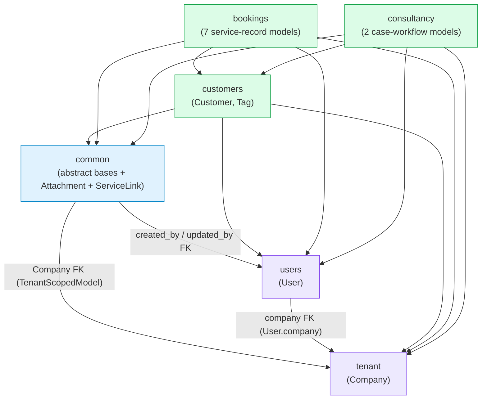

# SUFABASE — Architecture

Living document. Updated each time a new app is added; do not let this drift out
of sync with the actual codebase.

## Module progress

| Module | App(s) | Status |
|---|---|---|
| Module 01 — Foundation | `common`, `tenant`, `users`, `customers` | Built |
| Module 02 — RBAC & Security | — | Planned |
| Module 03 — Leads | — | Planned |
| Module 04 — Bookings (Hajj/Umrah/Tour) | `bookings` | Models built (schema only) |
| Module 05 — Ticketing / Hotel / Transport | `bookings` | Models built (schema only) |
| Service lines — Visa & Study Visa | `consultancy` | Models built (schema only) |
| Module 06 — Campaigns & Outreach | — | Planned |
| Module 07 — Multi-tenant Platform Admin | — | Planned |

## App dependency graph



## Layering pattern (every app follows this)

```
api/          ViewSets (thin: parse → selector → serializer)
serializers/  DRF serializers (one per model, read + write split)
filters/      django-filter FilterSets (the query-param contract)
selectors/    Query functions that take company explicitly
models/       Django models (one file per model)
admin.py      Django admin registration
tests/        Model, selector and API tests
```

Views never contain query logic or business rules. Business logic lives in
**services** (not yet introduced — Module 02+). Selectors own all query
construction and tenant filtering. The rule is explicit:

> Selectors receive `company` as a plain parameter. No thread-locals, no
> middleware magic, no ambient context.

### Selector layer

Where the selectors live, and what each one owns:

| File | Owns |
|---|---|
| `common/selectors.py` | `TenantScopedSelector` — the tenant filter for all 8 service models |
| `customers/selectors/customer_selectors.py` | `CustomerSelector`, `SERVICE_KEYS` |
| `customers/selectors/tag_selectors.py` | `TagSelector` |
| `users/selectors/user_selectors.py` | `UserSelector` |
| `tenant/selectors/company_selectors.py` | `CompanySelector` |
| `bookings/selectors/booking_selectors.py` | `BookingSelector`, `RELATED_BY_MODEL`, `PACKAGE_PREFETCHES` |
| `consultancy/selectors/consultancy_selectors.py` | `ConsultancySelector`, `CASE_RECORD_RELATED` |

All eight service models are queried through `common.selectors.TenantScopedSelector`,
so the `company=` filter is written once rather than eight times — eight copies
would be eight chances to forget it, and a forgotten tenant filter is a security
bug in this codebase.

**N+1 is treated as a bug, not a tuning opportunity.** Three rules hold it out:

1. **Eager loading is declared in the selector, never at the call site.**
   `BookingSelector.RELATED_BY_MODEL` and `ConsultancySelector.CASE_RECORD_RELATED`
   carry each model's relation set, so a new list view cannot forget it. It is a
   per-model map rather than one shared tuple for a concrete reason:
   `select_related('customer')` on `Package` raises `FieldError`, since `Package`
   has no customer link at all.
2. **Batch, never per-row.** `CustomerSelector.service_summary_for_customers`
   answers for N customers in the same 8 queries the single-customer form uses for
   one. Calling the singular form in a loop is 8 queries *per row* — 200 round
   trips for a 25-row page — and it hides well, because each individual call looks
   cheap. Selector tests assert the query count is independent of the row count
   rather than asserting a specific number.
3. **Read the FK column, not the relation.** `customer.company_id` is an already
   loaded column; `customer.company` is a dereference that silently issues a
   second SELECT. `TenantScopedSelector.for_customer` uses the former and a test
   pins the query count at 1.

**The cross-tenant trust boundary is the customer lookup, not the selector.**
`TenantScopedSelector.for_customer(model, customer)` scopes to *that customer's own
tenant*, read off the instance — it is not a guard, and handed another tenant's
customer it will answer for that tenant. The guard is the tenant-scoped lookup that
produces the customer: `CustomerSelector.get_by_id(company, pk)` returns `None` for
an id outside the caller's tenant, so a foreign customer is never passed in. Both
halves are tested together, because neither is safe to change alone.

## Filtering and search

Filtering is declarative and lives in `<app>/filters/<model>.py` as a
django-filter `FilterSet`; the viewset points at it with `filterset_class` and
carries no query logic of its own. Search and ordering are DRF's `SearchFilter`
and `OrderingFilter`, declared per view via `search_fields` / `ordering_fields`.

The shared vocabulary is defined once in `common/filters.py`, so four apps cannot
invent four spellings of the same idea:

| Parameter form | Meaning |
|---|---|
| `?name=ali` | substring match (`icontains`) — the default |
| `?name_exact=ali` | whole-value match, for identifiers people paste in |
| `?role=admin,manager` | one of several values (`InCharFilter`/`InNumberFilter`) |
| `?role_not=agent` | *not* one of several values |
| `?created_after=` / `created_before=` | range pair on any model (`AuditRangeFilterSet`) |
| `?updated_after=` / `updated_before=` | range pair on any model |
| `?unassigned=true`, `?has_email=false` | presence flags that cannot be empty-string comparisons |
| `?ordering=-created_at` | DRF `OrderingFilter`, rejected silently if unknown |
| `?search=` | DRF `SearchFilter`, substring across the view's `search_fields` |

Where each endpoint's FilterSet lives:

| Endpoint | FilterSet | Documented params |
|---|---|---|
| `/api/v1/customers/` | `customers.filters.customer.CustomerFilter` | 68 |
| `/api/v1/users/` | `users.filters.user.UserFilter` | 28 |
| `/api/v1/companies/` | `tenant.filters.company.CompanyFilter` | 24 |
| `/api/v1/tags/` | `customers.filters.tag.TagFilter` | 12 |

The authoritative list is the generated schema (`/api/docs/`); those counts are a
summary, not a second source of truth.

**Two invariants, both enforced by tests in `common/tests/test_filters.py`:**

1. *Every declared filter is documented.* `SchemaDocumentsEveryFilterTests`
   asserts each FilterSet's `base_filters` appears as a query parameter on its
   endpoint. Both of the ways filters went missing in this project were silent —
   declarations on a plain (non-`FilterSet`) mixin are discarded outright, and an
   exception during schema introspection drops the parameter list without failing
   the build — so the check is mechanical rather than trusting the source.
2. *A bad boolean is a 400, never a silently unfiltered 200.* django-filter's own
   `BooleanFilter` maps an unrecognised value to `None`, which it then reads as
   "parameter absent": `?is_active=maybe` returns **every** row with a 200. Use
   `common.filters.StrictBooleanFilter` everywhere; a test fails if a plain
   `BooleanFilter` is introduced anywhere in the project.

**Tenant scoping is never a query parameter.** A filter may narrow within the
caller's tenant and nothing more. Related-id filters rely on the view's
company-scoped queryset for that, and `TenantAwareFilterSet.company` exposes
`request.user.company` (server-side authoritative, passed to the filterset by
DRF) for any filter that needs to validate an id itself.

**Many-to-many filter parameters carry `distinct=True`.** A customer with two
matching tags would otherwise occupy two rows on a page, and the pagination
`count` would then disagree with the rows a client can actually iterate. For the
same reason `search_fields` lists only scalar columns and foreign keys: a
many-to-many path in search duplicates results unless the queryset is
de-duplicated, and a search box is the last place to pay that cost. Tag matching
is a dedicated filter (`?tags=`, `?tag_name=`, `?all_tags=`) instead.

## Tenant-scoping model

Every module app's models inherit `common.TenantScopedModel`, which provides:

- `company` — `ForeignKey('tenant.Company', on_delete=PROTECT)`
- `created_at` / `updated_at` — `TimeStampedModel` timestamps
- `created_by` / `updated_by` — `AuditModel` nullable SET_NULL FKs

The reverse accessor is `company.<app_label>_<model>_set` (e.g.
`company.customers_customer_set`).

**PROTECT, never CASCADE:** a company holds live client business data that cannot
be recovered once wiped. Hard-deleting a company is a deliberate, scripted
process that clears tenant data first.

The same rule extends outward: `bookings.ServiceRecordBase.customer` is PROTECT
too, so `customer.delete()` fails loudly while booking history exists. An
assignment, by contrast, is SET_NULL — losing one must never block removing a
staff account.

**Two models escape the tenant-scoping pattern:**

- `tenant.Company` inherits `BaseModel` (a company cannot belong to a company)
- `common.Attachment` and `common.ServiceLink` inherit `TenantScopedModel` but
  live in `common` because their whole point is to attach to any model in any
  module — no single module owns them

## Shared base model hierarchy

```
TimeStampedModel          (created_at, updated_at)
        │
AuditModel                (created_by, updated_by — nullable, SET_NULL)
        │
    BaseModel             (= TimeStampedModel + AuditModel)
        │
TenantScopedModel         (= BaseModel + company FK)
```

`BaseModel` is the default for models that are NOT tenant-owned (e.g. `Company`).
`TenantScopedModel` is the base for everything else.

## Bookings: the service-record pattern

`bookings` holds every record of something a customer bought for a date. Six of
its models inherit `ServiceRecordBase(TenantScopedModel)`. `Package` is the
booked bundle for one trip, and `PackageComponent` is the link to a real hotel,
ticket, or transport row. The sellable spec is `catalog.PackageTemplate`, which
`Package` may point at.

```
catalog.PackageTemplate
        │ spec lines (room, cabin, vehicle — no guest, no ticket number)
        │
        │ optional FK, SET_NULL
        ▼
bookings.Package  ◄── HajjBooking.package      (hajj_trips)
        │         ◄── UmrahBooking.package     (umrah_trips)
        │         ◄── TourBooking.package      (tour_trips)
        │
        └── PackageComponent ── exactly one of ── HotelBooking
                                              ├── TicketingBooking
                                              └── TransportBooking
```

`PackageTemplate` is defined before anyone is booked. It stores a name and spec
lines only. `Package` is created when those parts are actually booked for a
customer. It links the booking rows and does not copy guest names, ticket
numbers, or the template's room type and cabin. Deleting a bundle deletes the
link rows and leaves the bookings. Deleting a template only clears
`Package.template`.

`start_date`/`end_date` mean departure/return for Tour and Ticketing,
check-in/check-out for Hotel, and pickup date for Transport. Hajj and Umrah leave
them null: they are sold by year/season (`hajj_year`, `umrah_year_season`), not
by date, and a guessed date stored as fact is worse than an empty column.

**Status in this pass:** models, choices, migration, admin and tests only — no
serializers, selectors, viewsets or urls. `ServiceLink` is available for the
optional "Linked X Record" fields but is not wired to anything yet. See
`bookings/README.md` for the deliberate field omissions and known gaps.

## Consultancy: the case-workflow pattern

`consultancy` owns the last two of the eight service types in the field spec:
Visa Consultancy (visit/business/family/transit/work) and Study Visa. Together
with `bookings`, all eight are now modelled.

Two models share `CaseRecordBase(TenantScopedModel)`, which carries the customer
link, `destination_country`, an open/decision date pair, the service value and
currency, the assigned counselor and the `attachments` generic relation.

```
CaseRecordBase (abstract)
        │
        ├── VisaConsultancyCase   (visit / business / family / transit / work)
        └── StudyVisaCase         (admissions → enrolment reference → visa)
```

**A case is a process, not a dated transaction.** That is the whole reason this is
not part of `bookings`: a booking has a departure and a return, while a case has a
`case_open_date` and a `decision_date` months apart, and the interval between them
is the metric the business watches. Consequently `CaseRecordBase` has no
`start_date`/`end_date` at all, and a test fails if a booking-shaped date pair is
ever added here.

`VisaConsultancyCase` is one model for five visa categories rather than five
models, because the workflow is identical and only the category changes which
checklist and fee apply. It tracks three tracks in parallel with `status` —
document checklist, biometrics, passport collection — plus the embassy/tracking
fields that make a case answerable without opening a document.

`StudyVisaCase` is the inverse problem: most of its life is spent *before* a visa
exists, in the institution-admission pipeline. `status` therefore starts at
`NOT_READY` and cannot meaningfully advance until an enrolment reference has been
issued. Country flexibility comes from `enrolment_reference_type`
(CAS/CoE/I-20/LOA) rather than four country-specific column groups, so adding a
destination needs no migration.

`VisaDecisionChoices` and `BiometricsStatusChoices` are shared between both models
rather than duplicated — the underlying process is the same, and a test asserts
both reference the identical enum. `WITHDRAWN` and `DEFERRED` are kept distinct
from `REFUSED`, because folding them in would misstate the refusal rate.

**Status in this pass:** models, choices, migration, admin and tests only — no
selectors, serializers, filters or urls. See `consultancy/README.md` for the
deliberate field omissions and known gaps.

## Generic attachment and link models

`common.Attachment` and `common.ServiceLink` use Django's contenttypes framework
to attach files or link records without a dedicated FK per host model.

### Attachments over the API

One document model serves every module, so there is exactly one serializer pair
and two ways to reach it:

| Surface | Endpoint | Who uses it |
|---|---|---|
| Nested | `/<resource>/{id}/attachments/` (GET, POST) | The frontend. The host record comes from the URL |
| Flat | `/api/v1/attachments/` (GET, POST) and `/api/v1/attachments/{id}/` (GET, PATCH, DELETE) | Scripts, bulk views, a company-wide document library |

The nested action lives in `common/attachment_views.py` as
`AttachmentActionsMixin` and is mixed into all ten attachable viewsets (customer,
the six bookings, package, both consultancy cases). It is not copy-pasted per app
for the same reason `TenantScopedViewSetMixin` is not: ten copies of a tenant
check is nine chances to get it wrong.

What is enforced, and where:

- **Company scoping** — `AttachmentSelector` and the ViewSet mixin. The generic FK
  says nothing about the tenant, so the filter is explicit and written once.
- **Target validity** — `AttachmentSerializer.validate` re-checks the host record
  against the caller's company on the *flat* route too, so knowing a record id is
  not enough to staple a file onto another tenant's row. It also rejects models
  that never declared `attachments`.
- **Immutability** — an attachment cannot be re-pointed at a different record.
  Moving a document is a delete plus a fresh upload, which leaves an audit trail.
- **Query budget** — the nested list for one record costs 3 queries whether it
  holds 1 document or 60 (`target_label` is memoised per host, and
  `AttachmentSelector.counts_for_objects` batches counts).
- **`409` on protected deletes** — `common/exception_handler.py` maps
  `ProtectedError`/`RestrictedError` to a `409` naming the blocking models, rather
  than the `500` DRF would otherwise produce.

`Customer.avatar` is a plain nullable `ImageField` on the row — a profile picture
is one-per-customer and belongs in a column, not in the generic attachment table.
`MEDIA_URL`/`MEDIA_ROOT` are configured and served by Django in `DEBUG` only
(`config/urls.py`); production needs a web server or object storage in front.

### Still open (schema-level, pinned by tests)

- Deleting a host record leaves dangling attachments — no cascade is possible with
  generic FKs, so a cleanup service is needed on hard delete.
- The cross-tenant check is an **API-layer** guarantee. A direct ORM write can
  still create an attachment claiming one company while pointing at another's row.
- `content_type` is CASCADE — `remove_stale_contenttypes` could silently delete
  attachments for a removed model type.
- No file-size cap, no extension allow-list, no thumbnails, no virus scanning.
- `ServiceLink` still has no API at all.

## Authentication

JWT-based via `djangorestframework-simplejwt`. Token endpoints:

| Endpoint | Method | Description |
|---|---|---|
| `/api/v1/token/` | POST | Obtain access + refresh tokens |
| `/api/v1/token/refresh/` | POST | Refresh an expired access token |
| `/api/v1/token/logout/` | POST | Blacklist a refresh token |

`ACCESS_TOKEN_LIFETIME` and `REFRESH_TOKEN_LIFETIME` are configurable via `.env`.
Rotation + blacklist are enabled: each refresh issues a new refresh token and
blacklists the old one.

## API documentation

OpenAPI 3.0 schema generated by `drf-spectacular`:

| Endpoint | Description |
|---|---|
| `/api/schema/` | Raw OpenAPI schema (YAML/JSON) |
| `/api/docs/` | Swagger UI |
| `docs/openapi-schema.yml` / `.json` | Committed snapshots, for the frontend team and codegen |
| `docs/FRONTEND_API_GUIDE.md` | Hand-written integration guide: auth, headers, the response envelope, every endpoint, payload, filter and enum |

Every DRF view/serializer is auto-documented, and endpoints are auto-tagged by app
via `common/schema.py` (`AppTaggedSchema`) — no per-view decorators needed.

**Keep both in sync.** Any change to a view, serializer or filter must regenerate
the snapshot files, or the frontend's contract silently drifts from the code:

```bash
python manage.py spectacular --file docs/openapi-schema.yml --validate
python manage.py spectacular --format openapi-json --file docs/openapi-schema.json --validate
```

A non-zero exit from `--validate` is a real defect in the schema, not a
formatting complaint.
