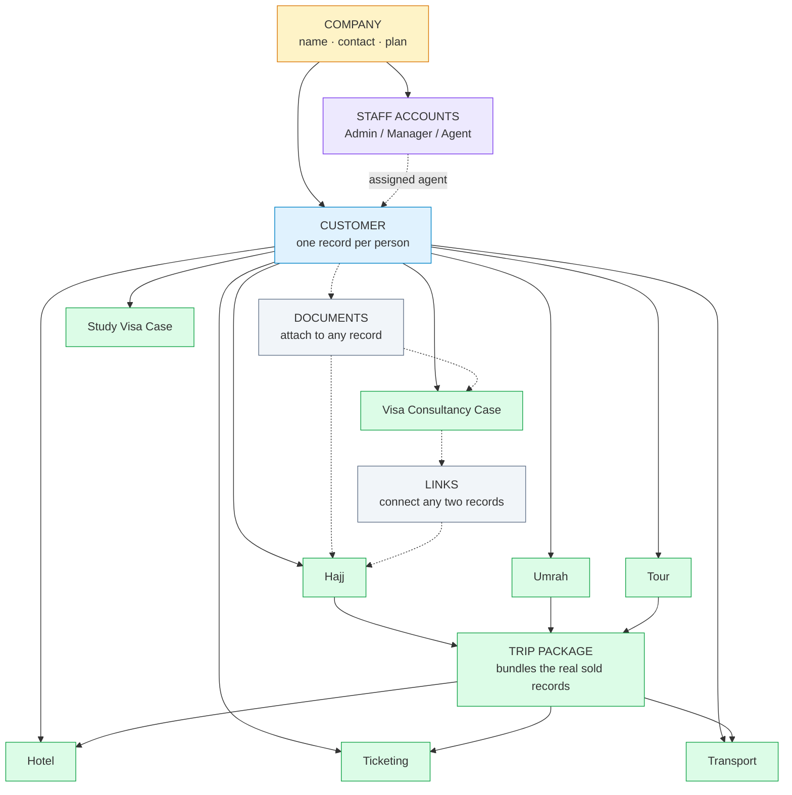

# SUFABASE — Foundation Review (Module 01)

**Prepared for:** SUFA International — management review
**Prepared by:** Development team
**Purpose of this document:** Approval of direction and pace

---

## 1. What we are asking you to approve

This document is not a training manual and not a design mock-up. It answers three
questions only:

1. **What has been built so far?**
2. **How do the pieces connect to each other?** — the relationships that carry
   your business data forward without rework.
3. **How will staff actually work with it day to day?** — the navigation and the
   information on each screen.

Nothing here is a final visual design. Colours, fonts and exact styling come later,
after this structure is signed off. What we need from you now is a decision on the
**shape of the system** — because that is the expensive thing to change later, and
it is the thing we have deliberately built first.

---

## 2. Where we are in the overall plan

SUFABASE is a seven-module programme. Module 01 is the foundation that every later
module stands on.

| # | Module | What it covers | Status |
|---|---|---|---|
| **01** | **Foundation** | Secure staff login, company setup, staff accounts, customer records | **Built — this review** |
| — | All 8 service records | Hajj, Umrah, Tour, Ticketing, Hotel, Transport, Visa Consultancy, Study Visa | **Data structure complete, ahead of its module** |
| 02 | Roles & Permissions | Who can see and do what, field-level masking | Next |
| 03 | Leads & Quotations | Enquiries, follow-ups, priced quotations | Planned |
| 04 | Bookings Operations | Hajj / Umrah / Tour working screens | Planned |
| 05 | Ticketing, Hotel, Transport | Supplier and travel operations | Planned |
| 06 | Campaigns & Outreach | Marketing, WhatsApp/email campaigns | Planned |
| 07 | Platform & Billing | Multi-company onboarding, plans, platform administration | Planned |

**A note on pace.** Module 01 is complete, and the data design for all eight of your
service lines is finished and in place. That second item was scheduled for later
modules — we pulled it forward because designing the service records before the
screens means the screens can be built without re-modelling the database underneath
them. It is the single biggest reason the remaining modules will move faster than
this one did. **The foundation phase is the slowest phase on purpose** — it is the
only phase where a change of mind is cheap.

---

## 3. The business picture — how everything connects

### 3.1 In one paragraph

Everything in SUFABASE sits under **one Company** — that is your business, the
tenant. Underneath that company are **your staff accounts** and **your customers**.
Every piece of work you do for a customer — a Hajj package, a ticket, a hotel stay,
a vehicle job, a tour, a visa case, a study-visa case — is a **service record** that
hangs off that one customer. Your customer is entered **once**, and every service
line reads from that same record. Documents can be attached to anything. Nothing is
ever duplicated per department.

### 3.2 The relationship map

```
                          ┌──────────────────────────┐
                          │        COMPANY           │
                          │   (your business/tenant) │
                          │  name · contact · plan   │
                          └────────────┬─────────────┘
                                       │
                 ┌─────────────────────┴─────────────────────┐
                 │                                           │
        ┌────────▼────────┐                       ┌──────────▼──────────┐
        │  STAFF ACCOUNTS │                       │      CUSTOMER       │
        │  role: Admin /  │                       │  the single "who is │
        │  Manager / Agent│                       │  this person" record│
        └────────┬────────┘                       └──────────┬──────────┘
                 │                                           │
                 │ assigned to                        every service
                 │                                           │
                 └──────────────────►┬────────────────────────┘
                                     │
       ┌─────────────────────────────┼──────────────────────────────┐
       │                             │                              │
┌──────▼──────┐            ┌─────────▼─────────┐          ┌─────────▼─────────┐
│  BOOKINGS   │            │      TRIP         │          │    CONSULTANCY    │
│  Hajj       │            │    PACKAGE        │          │  Visa Consultancy │
│  Umrah       │           │  bundles hotel +  │          │  Study Visa       │
│  Tour        │           │  tickets +        │          │                   │
│  Ticketing   │           │  transport for    │          │                   │
│  Hotel       │           │  one trip         │          │                   │
│  Transport   │           │                   │          │                   │
└─────────────┘            └───────────────────┘          └───────────────────┘
       │
       └──────────► DOCUMENTS can be attached to any record above
                    LINKS can connect any two records (e.g. a visa case
                    supporting a Hajj trip)
```

*The same diagram in a form that renders automatically is in section 6.*

### 3.3 The five relationships that matter

| Relationship | What it means in practice |
|---|---|
| **Company → everything** | Every staff account, customer and service record belongs to one company. Nothing can exist outside a company. This is what makes SUFABASE a platform rather than a single-business tool — a second company can be added later without rebuilding anything. |
| **Staff account → Company** | A staff member belongs to one company. Their **role** (Admin / Manager / Agent) is stored and visible now, but the rules about what each role may see and do are Module 02. |
| **Customer → Company** | A customer belongs to one company. **Customers are never shared across companies.** |
| **Service record → Customer** | Every one of the eight service types points at a single customer record. One person, one history — no separate "Hajj customer list" and "Visa customer list" that drift apart. |
| **Trip Package → hotel + tickets + transport** | A Hajj, Umrah or Tour record can be bundled with the hotel bookings, flight tickets and transport jobs that were actually sold for that trip. The bundle is a **link**, not a copy — so the ticket remains a real ticket and can still be reported on its own. |

### 3.4 Two deliberate design decisions worth knowing

**A customer record can never be deleted while they have service history.** The
system will refuse, loudly and immediately, rather than quietly erasing a family's
booking history. To retire a customer, staff set their status to **Archived** — the
record stays, the history stays, it simply drops out of active lists. The same rule
protects companies, which are retired by switching them **Inactive**, not deleted.

**Your eight service types are deliberately kept as eight types**, not merged into
one generic "booking". A flight ticket can be refunded and a hotel stay cannot; a
visa case runs for months with documents and embassy appointments, while a ticket is
a single dated transaction. Merging them would have made reports simpler to build
and wrong to read. Reports are easier to fix than decisions made on wrong numbers.

---

## 4. How staff will work with it — the dashboard layout

### 4.1 Navigation

```
SUFABASE
│
├── Dashboard                  ← today's picture: what needs attention
│
├── Customers                  ← the CRM. Everything starts here.
│   ├── Customer List          search, filter, export
│   ├── Add Customer
│   └── Customer Profile       the full record, tab by tab (section 4.3)
│
├── Bookings                   ← dated work sold to customers
│   ├── Hajj
│   ├── Umrah
│   ├── Tour
│   ├── Ticketing
│   ├── Hotel
│   └── Transport
│
├── Consultancy                ← case work, not dated bookings
│   ├── Visa Consultancy Cases
│   └── Study Visa Cases
│
└── Settings
    ├── Company Profile
    └── Staff Accounts         role assigned per person
```

Every list screen is built the same way, so staff learn one screen and know them
all: a **search box**, a **filter panel** on the left, a **results table** in the
middle, and a **detail panel** that slides in when you click a row.

### 4.2 What appears on each list screen

**Customers list** — the most-used screen in the system.

| Column | Filters available |
|---|---|
| Full Name | contains, exact |
| Phone / WhatsApp | contains, exact, "no WhatsApp" |
| City / Country | City, Country, Area, Sub-location |
| Assigned Agent | by agent, or "unassigned" |
| Status | Stage (New / Old) · Record Status (Active / Inactive / Archived) |
| Tags | any of, or all of |
| Created / Updated | date ranges |

Plus the filters that directly answer questions you already ask:

- **"Whose passport expires before the season?"** → passport expiry date range
- **"Which CNICs are expiring?"** → CNIC expiry date range
- **"Who is missing an email?"** → has-email / has-no-email
- **"Who has documents on file?"** → has-attachments / has-none
- **"Which Hajj-2026 customers are also tagged VIP?"** → tags, combined

**Service lists** (Hajj, Umrah, Tour, Ticketing, Hotel, Transport) — all share a
common set of columns, then add their own:

*Common to every service record:*

| Field | Notes |
|---|---|
| Customer | the link to the CRM record |
| Booking Reference | your own reference number |
| Start / End Date | means departure/return, check-in/check-out, or pickup — depending on the service |
| Amount + Currency | what it was sold for |
| Sales Agent | who sold it |
| Notes | free text |
| Documents | attached files |

*Then each service adds its own.* For example:

- **Hajj** — Hajj Year, Package Name, Package Type, Days in KSA, Group Name, Departure City, Status, Visa Status, Maktab Service Provider, Qurbani Arrangement, Room Type, linked Trip Package
- **Ticketing** — Passenger Name, PNR, E-Ticket Number, Airline, Flight Number, Origin, Destination, Departure/Arrival Time, Cabin Class, Baggage Allowance, Issue Date, Status, **Refund Status**
- **Hotel** — Lead Guest, Hotel Name, City/Country, Rooms, Room Type, Occupancy, Guests, Meal Plan, Confirmation Number, Status, Supplier Agent, Cancellation Deadline
- **Transport** — Lead Passenger, Service Type, Pickup & Drop-off, Pickup Time, Passengers, Vehicle Type, Vehicles, Supplier/Vendor, Arrival Flight Reference, Status

**Note on Hajj and Umrah:** these are sold by **year or season**, not by date, so
they deliberately do not carry departure/return dates. Inventing a date we do not
actually know would produce false reports.

### 4.3 The Customer Profile — what staff see on one person

This is the screen that makes the whole system worth it. Tabs, left to right:

| Tab | Contents |
|---|---|
| **Identity & Documents** | Full Name · Father/Husband Name · Gender · Date of Birth · CNIC Number & Expiry · Passport Number, Issue Date & Expiry · Nationality · Marital Status |
| **Contact & Address** | Phone · WhatsApp · Alternate Phone · Email · Country · City · Area · Sub-location · Complete Address |
| **Work & Business** | Profession · Business Type · Company Name · Designation · Business Address · Business Contact Number |
| **Assignment & CRM** | Customer Source · Referred By · Preferred Contact Method · Preferred Language · **Assigned Agent** · Notes |
| **Status & Consent** | Stage (New / Old) · Record Status (Active / Inactive / Archived) · Marketing Contact Permission |
| **Emergency Contact** | Name · Relationship · Number |
| **Family / Group** | Family Group Reference — links a family travelling together |
| **Tags** | Free-form labels: VIP, Hajj-2026, Referral-Partner, and so on |
| **Documents** | Uploaded files: CNIC copies, passports, offer letters, vouchers |
| **Services** | A live count of this customer's records across all eight service types, with a click-through to each list |

The **Services** tab is the point of the single-customer-record design. Open one
person and you immediately see everything they have ever bought from every
department, without asking another department.

### 4.4 The two consultancy screens

These are **case** screens, not booking screens — they track a process over months.

**Visa Consultancy Case** — Customer, Destination Country, Case Open Date, Decision
Date, Service Value, Assigned Counsellor, plus: Visa Category (Visit/Tourist,
Business, Family, Transit, Work), Purpose of Travel, Intended Travel Date, Status
(Consultation → Documents Pending → Ready to Apply → Submitted → In Process →
Approved / Refused → Closed), Embassy/VAC, Application Tracking Reference,
Submission Date, Appointment Date, **three independent tracks** — Document
Checklist, Biometrics, Passport Collection — Visa Decision, Visa Valid From/Until.

**Study Visa Case** — everything above plus the admissions pipeline that runs
*before* any visa exists: Study Level, Field of Study, Preferred Intake,
Institution, Institution Application Status, Offer Acceptance, Course Start Date,
Tuition Fee, Deposit Paid, Highest Qualification, English Test Type & Score,
Academic Documents Status, **SOP Status**, Financial Evidence Status, Enrolment
Reference Type (CAS-UK / CoE-Australia / I-20-USA / LOA-Canada) and Reference, plus
Medical/TB Status.

The three document/checklist tracks are separate fields on purpose: documents,
biometrics and passport return are owned by different people and move at different
speeds. Hiding them inside one "status" would lose exactly the information you need
to chase a stuck case.

---

## 5. What Module 01 deliberately does **not** include

Stating this plainly so expectations match the plan:

| Not included | Arrives in |
|---|---|
| Roles actually restricting what staff can see or do | Module 02 |
| Field-level masking (e.g. hiding passport numbers from junior staff) | Module 02 |
| Lead capture, follow-up reminders, quotations with pricing | Module 03 |
| Working Hajj/Umrah/Tour operational screens (status changes, margins) | Module 04 |
| Ticketing/hotel/transport supplier workflows and payment tracking | Module 05 |
| WhatsApp / email campaigns | Module 06 |
| Company onboarding, subscription plans, platform administration | Module 07 |
| **Payments, instalments and receipts** | Not yet scoped — see decision D4 |

Also deliberately left out, and to be added **only when you confirm you need them**:
seat numbers, driver name/contact, payment status on bookings, base fare and tax
breakdowns on tickets, sponsor/host details, travel insurance status, entry counts,
visa numbers, refusal reasons, campus/city, offer dates, scholarships, GPA, English
test dates, health cover and interview dates. These all exist in the field
specification as optional — the instruction was to hide them by default, and adding
one back is a small, safe change.

---

## 6. The same relationship map, in a form you can open

If you are reading this on GitHub or in a code editor that supports diagrams, the
block below renders as a picture. It shows the same structure as section 3.2.



---

## 7. Decisions we need from you

| # | Decision | Why it matters | Our recommendation |
|---|---|---|---|
| **D1** | Confirm the **eight service types** and their names as the permanent menu structure | This becomes the navigation your staff learn | Confirm as-is — all eight are modelled |
| **D2** | Confirm that **deleting a customer never erases their service history** (archive instead) | Data you cannot get back | Keep as built |
| **D3** | Confirm **roles: Admin / Manager / Agent** are the three to build on | Module 02 builds directly on these | Confirm, or supply your real titles |
| **D4** | **Payments** — bookings currently record only the agreed amount. Do you need instalments, receipts and outstanding balances? | Affects Modules 04 and 05 scope and timeline | Decide now if it is in the first release |
| **D5** | **Country field** — free text, or a fixed country list? | Free text allows typos and breaks reports | Fixed list with free text allowed as a fallback |
| **D6** | **Timezone** — does one platform timezone suffice, or must each company keep its own? | Affects all timestamps once there is more than one company | One platform timezone for now |
| **D7** | Are the **optional fields** listed in section 5 correct to leave out of the first release? | Keeps screens clean and development fast | Leave out; add on request |
| **D8** | **Approval of the pace** — see section 8 | Schedule and resourcing | Approve foundation-complete, proceed to Module 02 |

---

## 8. Pace — an honest read

**What is finished:** secure staff login, company setup, staff accounts with roles,
the full customer record, search and filtering across every customer field, the data
design for all eight service types, and the safety rules that protect client data
from accidental deletion.

**What is not:** there are no screens yet for a customer to be *seen* in. The
foundation is the database and the rules; the visible application — the screens in
section 4 — is the build that follows. This is the intended order, and it is the
reason Module 01 took longer than the modules after it will.

**Why the next phase is faster:** every screen built from here is a consistency
exercise, not a design exercise. The entities, their fields and their relationships
are fixed. That is what this document asks you to approve.

**The one genuine risk to the schedule** is scope added to Modules 02–05 before
Module 02 begins. Each module is designed to sit on the foundation without
disturbing it; a change to the foundation now is still cheap, and becomes expensive
after Module 03. If something in this document is wrong, **this is the moment to say
so.**

---

## 9. Approval

| | Name | Signature | Date |
|---|---|---|---|
| Business owner | | | |
| Technical lead | | | |

**Approved to proceed to Module 02 (Roles & Permissions):** ☐ Yes ☐ Yes, with changes noted above ☐ No

---

# Appendix — Image-generation prompts

Use these to produce a one-page visual for a presentation or a printed leave-behind.
They are written for AI image tools (Midjourney, DALL·E, Firefly, Ideogram).

**Read this first.** Image generators render written text badly and will invent
garbled labels. Every prompt below therefore asks for **little or no text** — treat
the output as a *shape* to show structure and mood, and let the real labels come from
sections 3 and 4 of this document. If you need a labelled, accurate diagram for the
client, the Mermaid block in section 6 is the honest option, and a designer can
tidy it.

### Prompt 1 — "How everything connects" (relationship picture)

```
A clean modern business systems diagram, flat vector illustration, soft rounded
cards connected by thin elegant lines, generous white space, isometric depth without
clutter. At the top centre one large highlighted card representing a company
headquarters. Below it two branches: a row of small circular avatar cards
representing staff accounts, and one wide card representing a customer record. From
the single customer card, eight identical cards fan out in a neat arc, each with a
simple distinct icon: a mosque silhouette, a crescent moon, a landmark building, an
aeroplane, a bed, a car, a passport, a graduation cap. From three of the central
cards, fine dashed lines converge onto one smaller grouped card in the lower middle
that holds a bed, a plane and a car icon together. Small paperclip and link icons sit
in the corners of several cards. Muted professional palette: deep teal, soft navy,
warm sand and off-white, one accent colour for highlights. Saharan-soft shadows,
crisp thin strokes, corporate but warm, presentation-slide quality, 16:9,
no text, no letters, no words, no lorem ipsum, no watermarks.
```

### Prompt 2 — "What the client sees" (dashboard layout picture)

```
A flat vector UI wireframe of a modern SaaS business dashboard, three-quarter
presentation angle, no readable text anywhere. Left vertical navigation rail with a
small logo mark at the top and six grouped menu items, each an icon with a subtle
grey placeholder bar beside it. Top horizontal bar containing a search field, a
notification bell and a circular user avatar. Main content area showing three
small statistic cards along the top row with simple number glyphs and tiny upward
trend lines, a large data table below with eight rows and five columns of grey
placeholder bars, a filter sidebar on the left of the table with checkbox and
dropdown shapes, and a detail drawer sliding in from the right showing a circular
profile photo placeholder, a row of tab shapes and several labelled field groups
separated by thin dividers. Very light grey page background, white cards with soft
shadows and 12px rounded corners, teal and navy accents, one amber highlight for the
selected row. Clean, calm, enterprise-grade, high fidelity, dribbble quality,
16:9, no text, no letters, no words, no fake lorem ipsum, no watermarks.
```

### Prompt 3 — "The customer journey" (optional — pipeline picture)

```
A minimal horizontal process diagram, flat vector, five rounded pill-shaped stages
connected left to right by a thin arrowed line on a very light background. Stage
one: a simple speech-bubble icon. Stage two: a person profile icon in a circle.
Stage three: an aeroplane ticket icon. Stage four: a folder with a paperclip.
Stage five: a shield with a checkmark. Each stage sits on a soft white card with
generous padding and a small circular numbered badge above it, with an empty grey
placeholder bar beneath each card for a caption to be added later. Muted teal,
navy and warm sand palette with one accent colour, crisp thin strokes, plenty of
white space, presentation quality, 16:9, no text, no letters, no words,
no watermarks.
```

### If you want the prompts to include labels

Only do this with a tool that handles text well, and expect to fix spelling by hand.
Append this line and then proofread every generated label:

```
Include the following short labels in a clean geometric sans-serif:
COMPANY, STAFF, CUSTOMER, HAJJ, UMRAH, TOUR, TICKETING, HOTEL, TRANSPORT,
VISA CONSULTANCY, STUDY VISA, TRIP PACKAGE, DOCUMENTS.
```
